<!-- The banner is generated by tools/banner.py (one SVG per theme). -->
<a href="https://rishabh0111.github.io/">
  <picture>
    <source media="(prefers-color-scheme: dark)" srcset="assets/banner-dark.svg">
    
  </picture>
</a>

  
  
  
  

Hi, I'm Rishabh, a software engineer from India. I work on LLM systems and
the backends and infrastructure underneath them, and I care a lot about one
question: *how do you know it works?* So I build things in the open, measure
them, and write up what I got wrong along the way.

If any of it is useful to you, take it. If something looks wrong, open an
issue; I'd rather know.

## Learn with me

Two free series on my blog, written the way I wish someone had explained
them to me. Diagrams, worked examples, no paywall, no sign-up.

<table>
<tr>
<td width="50%" valign="top">

### [Data Structures & Algorithms, Pattern by Pattern](https://rishabh0111.github.io/blogs/dsa-the-method/)

19 parts, from arrays and hashing to 2-D dynamic programming. Each one
teaches a pattern you can recognise in a problem you haven't seen, rather
than a list of solutions to memorise.

[Start with part 1 →](https://rishabh0111.github.io/blogs/dsa-the-method/)

</td>
<td width="50%" valign="top">

### [System Design](https://rishabh0111.github.io/blogs/system-design-foundations/)

10 parts, from the first principles to caching, queues, databases and
distributed primitives. Each part answers a real "why would you do that?"
rather than listing boxes on a whiteboard.

[Start with part 1 →](https://rishabh0111.github.io/blogs/system-design-foundations/)

</td>
</tr>
</table>

## Things I've built

Every one of these is open source, runs with `docker compose up` or one
command, and has a write-up explaining the decisions, including the ones I
reversed.

<table>
<tr>
<td width="50%" valign="top">

### [Nivara Desk](https://nivara-landing-iota.vercel.app)

A help desk many companies share, where the AI answers only when it's sure
and hands everything else to a person. A good read if you're figuring out
evals, guardrails or multi-tenant Postgres.

[AI layer](https://github.com/rishabh0111/nivara-ai) · [API](https://github.com/rishabh0111/nivara-api-nestjs) · [Front ends](https://github.com/rishabh0111/nivara-web-nextjs) · [Watch it (45 s)](https://rishabh0111.github.io/assets/img/home/projects/nivara/walkthrough.mp4) · [Try it, signed in](https://nivara-web-nextjs.vercel.app/dashboard?demo) · [Evals write-up](https://rishabh0111.github.io/blogs/evals-for-an-llm-agent/)

</td>
<td width="50%" valign="top">

### [Nostro](https://github.com/rishabh0111/nostro-ledger)

A double-entry ledger in Java where the database itself refuses a write that
doesn't balance. Useful if you want to see the transactional outbox, Kafka
and read-your-writes done end to end.

[Source](https://github.com/rishabh0111/nostro-ledger) · [Write-up](https://rishabh0111.github.io/blogs/multitenant-double-entry-ledger/)

</td>
</tr>
<tr>
<td width="50%" valign="top">

### [LinkPulse](https://github.com/rishabh0111/linkpulse)

A tiny URL shortener used as an excuse to run a real platform: Terraform,
Kubernetes, GitOps and monitoring, then breaking it on purpose on AWS to see
which alerts actually fire. Cost me $3.32.

[Source](https://github.com/rishabh0111/linkpulse) · [Write-up](https://rishabh0111.github.io/blogs/production-grade-devops-platform/)

</td>
<td width="50%" valign="top">

### [Webhook Delivery Engine](https://github.com/rishabh0111/webhook-delivery-engine)

Sends webhooks and never quietly loses one, even if you wipe Redis halfway
through. Self-hostable, with retries, signing and a dead-letter queue you
can replay from a dashboard.

[Source](https://github.com/rishabh0111/webhook-delivery-engine) · [Watch it (20 s)](https://rishabh0111.github.io/assets/img/home/projects/webhook/tour.mp4) · [Try it](https://webhook-delivery-engine-on21.onrender.com/dashboard) · [Write-up](https://rishabh0111.github.io/blogs/webhook-delivery-engine/)

</td>
</tr>
</table>

**Small tools and notes you might find handy:**
[cover-kit](https://github.com/rishabh0111/cover-kit) turns a JSON spec into
an animated GIF cover for a technical post ·
[the-essential-150](https://github.com/rishabh0111/the-essential-150) is a
curated set of DSA prerequisites and interview patterns ·
[ComputerNetworKing](https://github.com/rishabh0111/ComputerNetworKing) covers
networking from the basics up

<b>Five things I learned the hard way</b>

 

- **Test the claim you're proudest of.** The durability test on my webhook
  engine found a durability bug: wiping Redis left thousands of events stuck
  until a restart. A small watchdog fixed it, and now the test passes.
- **Check your judge.** An LLM grader I relied on barely agreed with human
  labels, so I stopped publishing its score.
- **Make every alert fire at least once.** Two of mine were loaded, "healthy"
  and could never fire. I only found out by causing the failures on purpose.
- **Isolation has to reach the search index too.** My vector search was
  leaking ranking statistics between tenants, even though the rows were
  filtered correctly.
- **Delete the advice that doesn't pay.** Reranking is standard advice, but
  it didn't move recall on my data, so it went. The write-up keeps the
  experiment, not just the conclusion.

## Latest writing

<!-- Kept current by .github/workflows/latest-posts.yml from the site's feed. -->
<!-- BLOG-POST-LIST:START -->
- [I built a production-grade ledger in Java 21 and Spring Boot 4 where money can’t go missing](https://rishabh0111.github.io/blogs/multitenant-double-entry-ledger/)
- [Every chat message needs an ID nobody coordinated on, and every request needs a caller nobody can fake](https://rishabh0111.github.io/blogs/system-design-distributed-primitives/)
- [An order confirmation email should never be the reason a checkout button spins for three seconds](https://rishabh0111.github.io/blogs/system-design-async/)
- [Caching is the easy 80%. Knowing when a cached answer is a lie is the hard 20%](https://rishabh0111.github.io/blogs/system-design-caching/)
- [A product catalog and a bank ledger have no business living in the same kind of database](https://rishabh0111.github.io/blogs/system-design-databases-nosql/)<!-- BLOG-POST-LIST:END -->

[All posts →](https://rishabh0111.github.io/blogs/)

## Say hi

Happy to talk about LLM evals, Postgres, distributed systems or Kubernetes,
or to hear what you're building. Open an issue on any repo, or
[email me](mailto:rishabhsharma8912@gmail.com).

Off the clock: chess, technical writing, 10-finger typing, and poking around
other people's infrastructure.

<!-- Drawn daily by .github/workflows/snake.yml onto the `output` branch. -->
<picture>
  <source media="(prefers-color-scheme: dark)" srcset="https://raw.githubusercontent.com/rishabh0111/rishabh0111/output/snake-dark.svg">
  
</picture>
